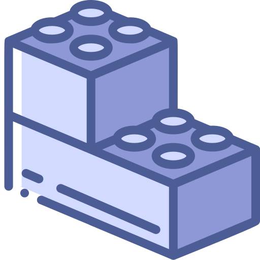
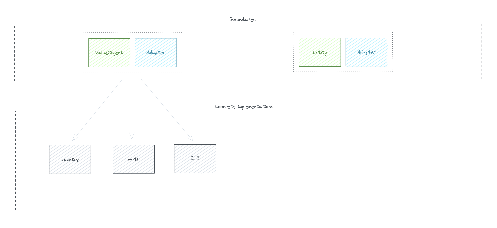

<!--suppress HtmlDeprecatedAttribute -->

    

# Tiny Blocks

## Overview

Before explaining the purpose of the library, it is important to present a summary of the concept on which it is
based.

Building Blocks from **D**omain **D**riven **D**esign are different types of components. These components have the
function of highlighting some ideas, concepts or business rules in a code. Basically, they are reusable software
components, which provide functionality and behavior, facilitating generic workflows.

The purpose of this library is to facilitate the implementation of Building Blocks, through granular and pluggable
implementations, which guarantee limits and behaviors.

The image below shows the project's conceptual dependencies, where libraries that encapsulate concepts are used by
concrete implementations.

    
     
    <tl>Conceptual dependence.</tl>

## License

All code from the **Tiny Blocks** project is licensed under the [MIT](/LICENSE) license.

## Contributing

Please follow the [contribution guidelines](/CONTRIBUTING.md) to contribute to the project.

## Code of Conduct

This project and everyone participates in it is governed by the [code of conduct](/CODE_OF_CONDUCT.md). By
participating, you are expected to uphold this code.
