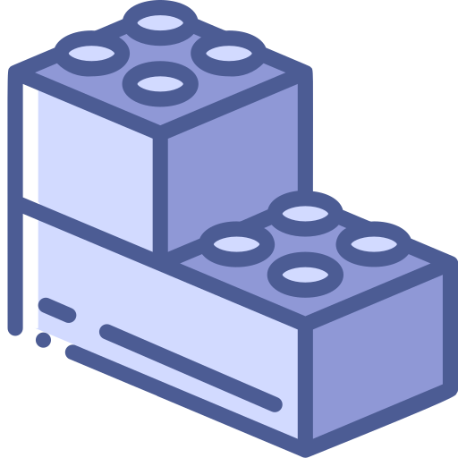
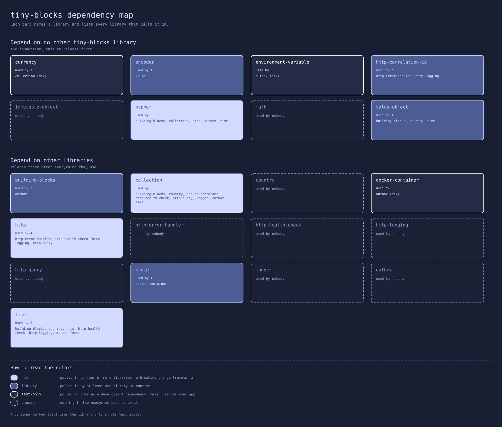

<!--suppress HtmlDeprecatedAttribute -->

    

# Tiny Blocks

* [Overview](#overview)
* [Dependencies](#dependencies)
* [License](#license)
* [Contributing](#contributing)
* [Code of Conduct](#code-of-conduct)

## Overview

**Tiny Blocks** is a set of small, focused, framework-agnostic PHP libraries. Each one solves a single problem and can
be adopted on its own, without pulling in the rest.

The building blocks cover the parts most applications rewrite from scratch: collections, time, HTTP primitives and
middleware, object mapping, structured logging, identifiers, encoding, arbitrary precision numbers, and value object
contracts. Most of them are general-purpose and stay out of your architecture.

Some go further and implement a known pattern end to end, for the cases where getting it right by hand is the expensive
part. The tactical building blocks of Domain Driven Design come ready to use: entities, aggregate roots, domain events,
snapshots, and upcasters. The Transactional Outbox pattern comes as a write-side adapter that persists domain events in
the same transaction as the aggregate state, so a published event and the state that produced it can never disagree.

You take these only if you want them. Nothing here dictates how you model your domain.

This repository is the organization landing page. It holds no library code. Each library lives in its own repository and
follows the same conventions, so moving between them costs nothing.

## Dependencies

The libraries build on each other. Each card below names a library and lists every library that pulls it in, so you can
see how far a breaking change travels before you make one.

## License

All code from the **Tiny Blocks** project is licensed under the [MIT](LICENSE) license.

## Contributing

Please follow the [contribution guidelines](CONTRIBUTING.md) to contribute to the project.

## Code of Conduct

This project and everyone who participates in it is governed by the [code of conduct](CODE_OF_CONDUCT.md). By
participating, you are expected to uphold this code.
